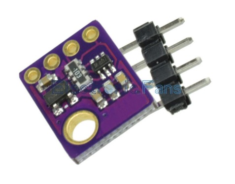

# Getting started with Arduino or NodeMCU development

Fiddeling with Arduino to get started.

#### Install an editor like Atom:
* https://atom.io/

#### Install PlatformIO:
* http://docs.platformio.org/en/stable/installation.html

#### Install drivers for NodeMCU:
* [Driver page](https://www.silabs.com/products/mcu/Pages/USBtoUARTBridgeVCPDrivers.aspx)
    * [Mac OS X](http://www.silabs.com/Support%20Documents/Software/Mac_OSX_VCP_Driver.zip)
    * [Windows](http://www.silabs.com/Support%20Documents/Software/CP210x_Windows_Drivers.zip)
    * [Linux](http://www.silabs.com/Support%20Documents/Software/Linux_3.x.x_VCP_Driver_Source.zip)


# Start a new project with Arduino Uno

#### Init project with PlatformIO:
```bash
$ mkdir Arduino-hello-world/
$ cd Arduino-hello-world/
$ platformio init --board uno
```

_Start developing :)_

Or download [a blinking led example project](https://github.com/5orenso/nodemcu-blinking-led)

#### Upload to controller:
```bash
$ platformio run -e uno -t upload
```

#### Show device monitor:
```bash
$ platformio device monitor
```


# Start a new project with NodeMCU

####Install drivers for NodeMCU
https://www.silabs.com/products/mcu/Pages/USBtoUARTBridgeVCPDrivers.aspx

####Init project with PlatformIO
```bash
$ cd NodeMCU-hello-world/
$ platformio init --board nodemcuv2
```

_Start developing :)_

Or download [a blinking led example project](https://github.com/5orenso/nodemcu-blinking-led)

#### Upload to controller and show device monitor:
```bash
$ pio run -e nodemcuv2 -t upload && pio serialports monitor -b 115200
```

#### Upload to controller only:
```bash
$ platformio run -e nodemcuv2 -t upload
```

#### Show device monitor only:
```bash
$ platformio serialports monitor -b 115200
```

# Start a new project with Wemos D1 mini

#### Install drivers for Wemos D1 mini
http://kig.re/downloads/CH34x_Install.zip

####Init project with PlatformIO
```bash
$ cd NodeMCU-hello-world/
$ pio init --board d1_mini
```

_Start developing :)_

Or download [a blinking led example project](https://github.com/5orenso/nodemcu-blinking-led)

#### Upload to controller and show device monitor:
```bash
$ pio run -e d1_mini -t upload && pio serialports monitor -b 115200
```

#### Upload to controller only:
```bash
$ pio run -e d1_mini -t upload
```

#### Show device monitor only:
```bash
$ pio serialports monitor -b 115200
```


## Project inspiration

* [Home environment sensors](https://github.com/5orenso/nodemcu-mqtt-home-sensors)
* [BME280 temperature, humidity and airpressure sensor](https://github.com/5orenso/nodemcu-mqtt-bme280)
* [Led animations. WS2811, Neopixels](https://github.com/5orenso/nodemcu-neopixel-animations)
* [Toilet project sensors](https://github.com/5orenso/nodemcu-mqtt-toilet-project)
* [Toilet project light display](https://github.com/5orenso/nodemcu-mqtt-toilet-project-display)
* [Bitbar toilet menu plugin](https://github.com/TeliaSoneraNorge/iot-hackaton-toilet-u1-bitbar)
* [AMI for MQTT Broker](https://github.com/5orenso/aws-ami-creation)


# Shopping list

#### Need to have

| Description                       | Picture                                  | Price |
|-----------------------------------|------------------------------------------|-------|
| [ESP8266 NodeMCU v2](https://www.aliexpress.com/item/Update-Industry-4-0-New-esp8266-NodeMCU-v2-Lua-WIFI-networking-development-kit-board-based-on/32358722888.html?spm=2114.13010608.0.0.nAiZf1) |  | $4.00  |
| [Dupont line 120pcs 20cm male to male + male to female and female to female jumper wire](https://www.aliexpress.com/item/Dupont-line-120pcs-20cm-male-to-male-male-to-female-and-female-to-female-jumper-wire/1728903423.html?spm=2114.13010608.0.0.m3Qohh) |  | $2.55  |
| [140 pcs U Shape Solderless Breadboard Jumper Cable Wire Kit](https://www.aliexpress.com/item/Free-Shipping-140pcs-in-one-package-convenient-New-Solderless-Flexible-Breadboard-Jumper-wires-Cables-HOT-Sale/1621833882.html?spm=2114.13010608.0.0.m3Qohh) |  | $2.10  |
| [Breadboard 830 Point PCB Board MB-102 MB102](https://www.aliexpress.com/item/SHIPPING-1pcs-Breadboard-830-Point-PCB-Board-MB-102-MB102-Test-Develop-DIY-kit-nodemcu-raspberri/32219206014.html?spm=2114.13010608.0.0.WgO27Y) |  | $1.90  |
| [1 Pack 300Pcs 10 -1M Ohm 1/4w Resistance 1% Metal Film Resistor Resistance Assortment Kit Set 30 Kinds Each 10pcs](https://www.aliexpress.com/item/1-Pack-300Pcs-10-1M-Ohm-1-4w-Resistance-1-Metal-Film-Resistor-Resistance-Assortment-Kit/32505894332.html?spm=2114.13010608.0.0.Pjis9T) |  | $1.60  |
| [Breakout BME280 Digital Sensor Temperature Humidity Barometric Pressure Altitude Sensor Precision Module](https://www.aliexpress.com/item/Breakout-BME280-Digital-Sensor-Temperature-Humidity-Barometric-Pressure-Altitude-Sensor-Precision-Module-for-Arduino/32672210336.html?spm=2114.13010608.0.0.aNQtWq) |  | $5.20 |


#### Nice to have

| Description                       | Picture                                  | Price |
|-----------------------------------|------------------------------------------|-------|
| [PIR Sensor Human Body detecting module Pyroelectric HC-SR501](https://www.aliexpress.com/item/NEW-PIR-Sensor-Human-Body-detecting-module-Pyroelectric-HC-SR501-For-Arduino-MCU-Freeshipping/1856571305.html?spm=2114.10010108.1000013.3.RpWnIf&scm=1007.13339.33317.0&pvid=f4ea8048-4a57-4d28-b810-e2d5a3b4ec79&tpp=1) |  | $3.27 |
| [37 sensor kit in 1 box Sensor Kit module](https://www.aliexpress.com/item/37-sensor-kit-in-1-box-Sensor-Kit-module-Suite-Variety-for-Arduino-with-Retail-Box/32566328155.html?spm=2114.01010208.3.1.QnEAuf&ws_ab_test=searchweb0_0,searchweb201602_2_10065_10068_10069_10087_10084_10083_10086_10017_10080_10082_10081_10060_10061_10062_10056_10055_10054_10059_10078_10079_10073_10070_10052_10053_422_10050_10051,searchweb201603_1&btsid=83674438-4acb-444e-9db9-c1116a066440) |  | $22.28 |
| [Waterproof DS18b20 temperature probe temperature sensor](https://www.aliexpress.com/item/1PCS-Waterproof-DS18b20-temperature-probe-temperature-sensor-Stainless-steel-package-100cm-wire/32582665519.html?spm=2114.13010608.0.0.cymlon) |  | $1.30 |
| [6 Pcs Anti-static ESD Tweezers Set Straight Curved](https://www.aliexpress.com/item/6pcs-ESD-Anti-Static-Stainless-Steel-Tweezer-Set-Tweezers-Maintenance-Tools-Kit/1766539602.html?spm=2114.13010608.0.0.TDP3lb) |  | $4.50  |
| [Presisjonsskrutrekkersett](http://www.biltema.no/no/Verktoy/Handverktoy/Skrutrekkere-og-Bits/Presisjonsskrutrekker/Presisjonsskrutrekkersett-rettsporPH-7-stk-2000028398/) |  | NOK 109 |
| [Minitenger](http://www.biltema.no/no/Verktoy/Handverktoy/Tenger-og-Sakser/Minitenger-4-stk-2000031648/) |  | NOK 119 |


## Other external resources

* https://www.losant.com/blog/getting-started-with-platformio-esp8266-nodemcu
